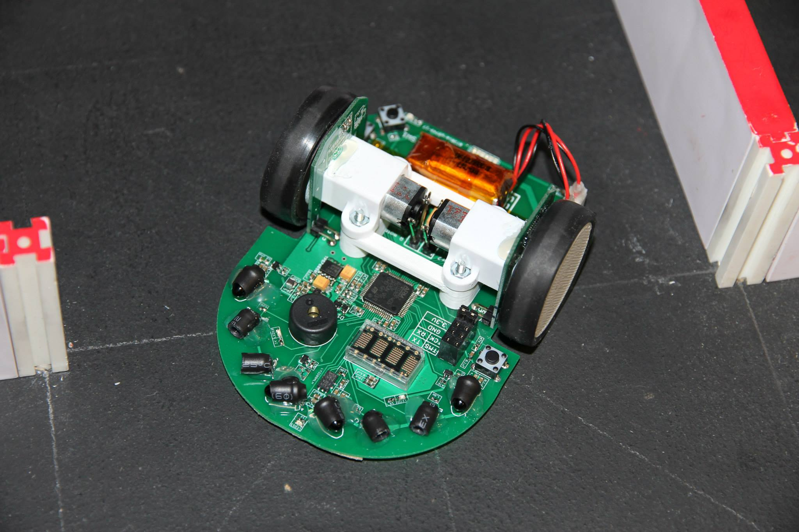
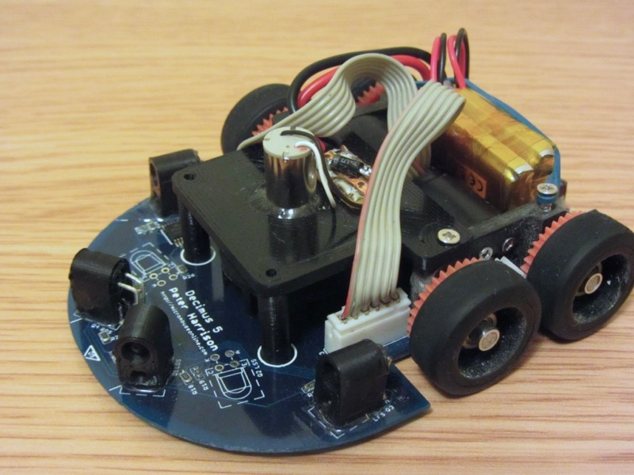
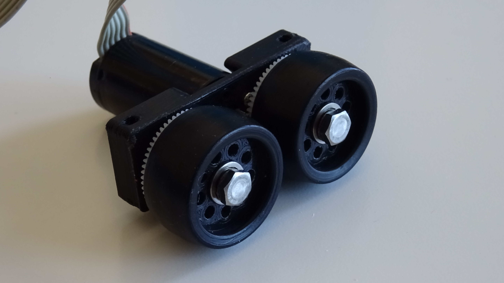

% Bulebule: *making off* the un robot *micromouse* :mouse:
% Clara Casas Castedo & Miguel Sánchez de León Peque
% 2018-02-16

Introducción
============

Micromouse
==========

Necesidades de Hardware
=======================

Diseño de la placa
==================

Sensores
========

Robot physics
=============

Goals
-----

>- Straight lines
>- Turns
>- :+1: :joy:

Limitations :sweat_smile:
-------------------------

- Acceleration

System
-------

Angular velocity
----------------

$$
\begin{aligned}
\overline{v_2} &= \overline{v_1} + \overline{w} \wedge \overline{r_{21}} \\
v_2 \overline{u} &= v_1 \overline{u} + (w \overline{u_z}) \wedge (2d \overline{t}) \\
v_2 &= v_1 + 2dw \\
\\
w &= \frac{v_2 - v_1}{2d}
\end{aligned}
$$

Linear velocity
---------------

$$
\begin{aligned}
\overline{v_M} &= \overline{v_1} + \overline{w} \wedge \overline{r_{M1}} \\
v_M \overline{u} &= v_1 \overline{u} + (w \overline{u_z}) \wedge (d \overline{t}) \\
v_M &= v_1 + wd \\
&= v_1 + \left(\frac{v_2 - v_1}{2d}\right)d \\
\\
v_M &= \frac{v_1 + v_2}{2}
\end{aligned}
$$

Mechanical design
=================

Wheels... but how many?
-----------------------

---

{width=80%}

Image taken from [micromouseusa.com](http://micromouseusa.com/wp-content/uploads/2014/03/futura-Cover.jpg).

---

{width=70%}

Image taken from [micromouseonline.com](http://www.micromouseonline.com/wp/wp-content/uploads/2017/10/Decimus5A.jpg).

---

{width=70%}

Image taken from [micromouseonline.com](http://www.micromouseonline.com/wp/wp-content/uploads/files/CIMG1994-full.jpg).

---

{width=70%}

Image taken from [micromouseonline.com](http://www.micromouseonline.com/wp/wp-content/uploads/2015/11/IMG_5761.jpg).

Better start with 4...
----------------------

{width=50%}

[More about "tetra" designs](https://athena-robots.readthedocs.io/en/latest/tetra.html).

CAD designs
-----------

- [Motor mount](https://github.com/Theseus/bulebule/blob/master/3d/mount.py)
- [Rim](https://github.com/Theseus/bulebule/blob/master/3d/rim.py)
- Both designed with [CadQuery](https://github.com/dcowden/cadquery) (Python)
- 3D printed (FDM)

---

---

{width=889 height=500}

Control
=======

Maze-solving algorithm
======================

Required tools
==============

Errors, debugging...
====================

Costs
=====

Next stop: Portugal :tada:
==========================

Current state
-------------

{width=889 height=500}

TODO
----

- Gyroscope integration (PCB redesign)
- Maybe new wheels
- More complete maze exploration
- Path selection
- Fast run
- Diagonals
- ~60 issues in GitHub :muscle: :muscle:

Thanks :heart:
--------------

**Green Ye**

: Who shares [details about his micromice](http://www.greenye.net/) and posts many useful resources in [micromouseusa.com](http://micromouseusa.com>)

**Peter Harris**

: Who posts many useful and detailed resources in [micromouseonline.com](http://micromouseonline.com)

**Kato-san**

: Who shares [details about his micromice](http://seesaawiki.jp/w/robolabo/)
  and posts some [useful resources](http://blog.livedoor.jp/robolabo/)

Links :link:
-----

- [https://github.com/Theseus/bulebule](https://github.com/Theseus/bulebule)
- [https://bulebule.readthedocs.io](https://bulebule.readthedocs.io)

{width=40%}
